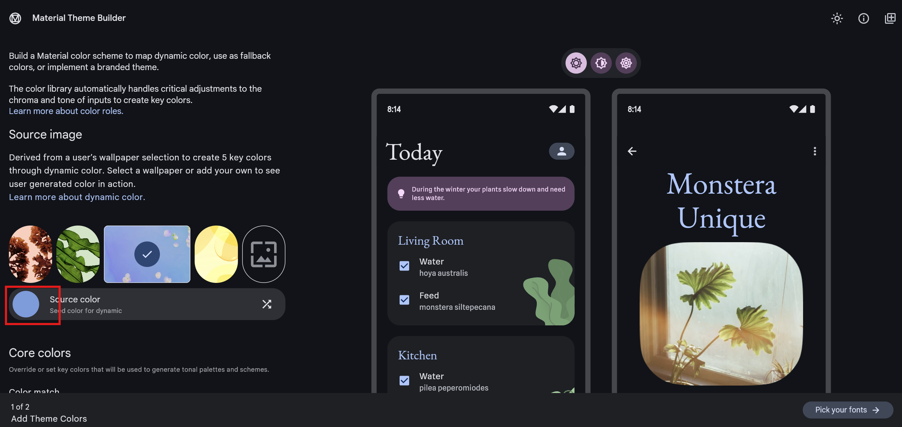
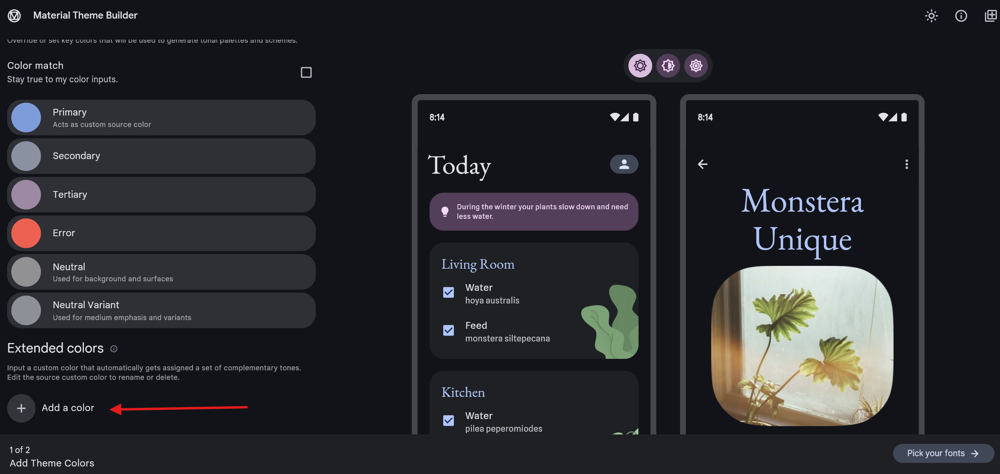
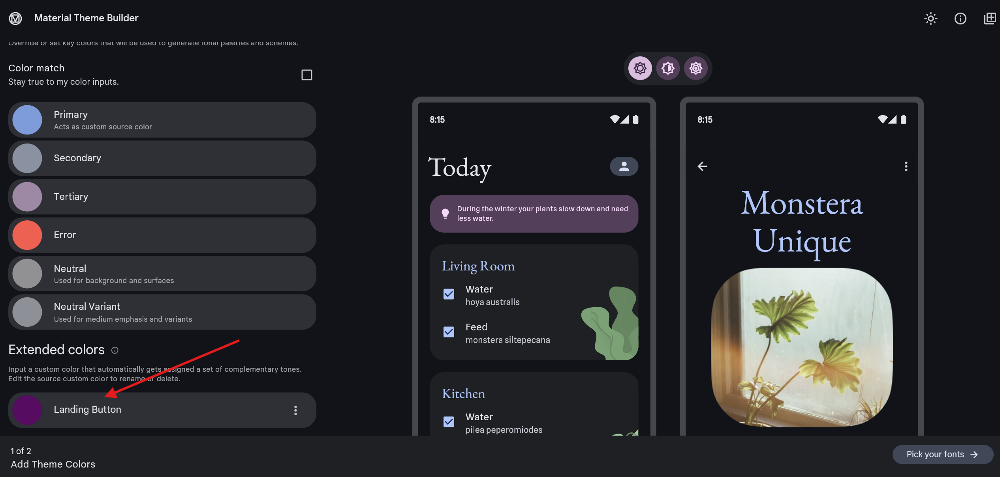
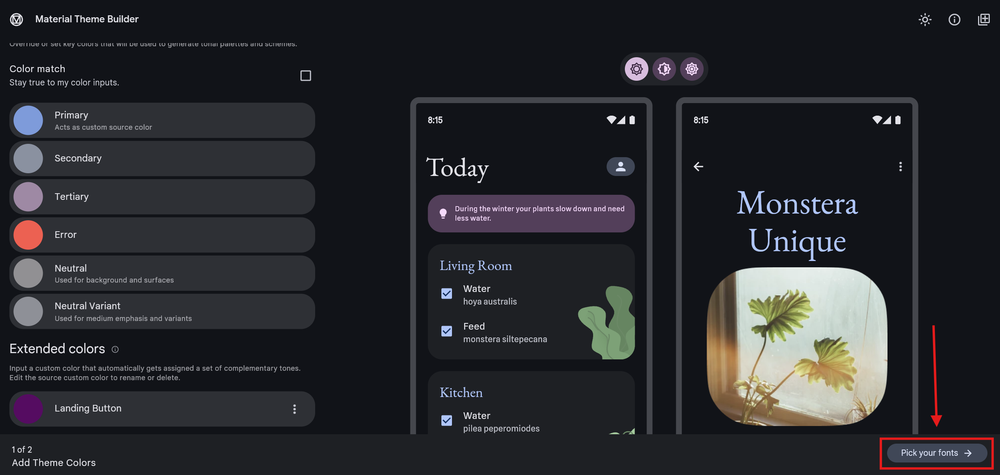
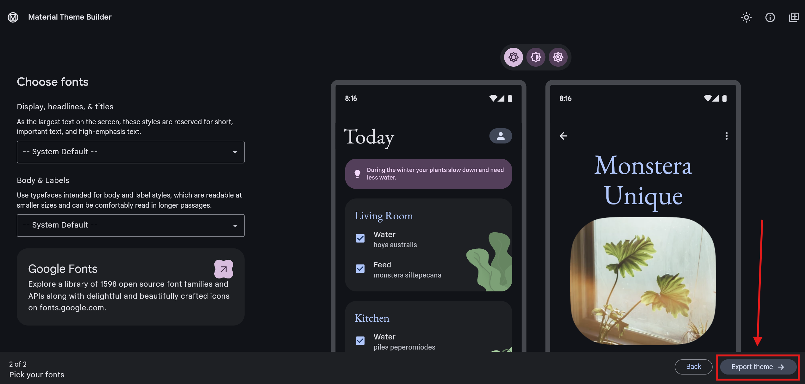
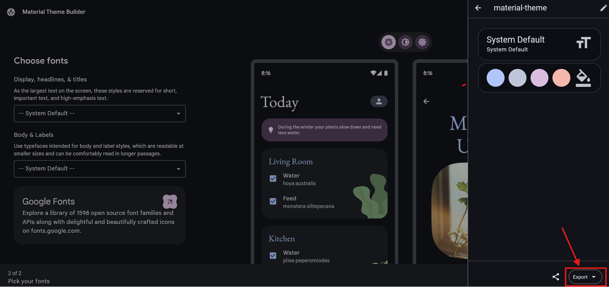
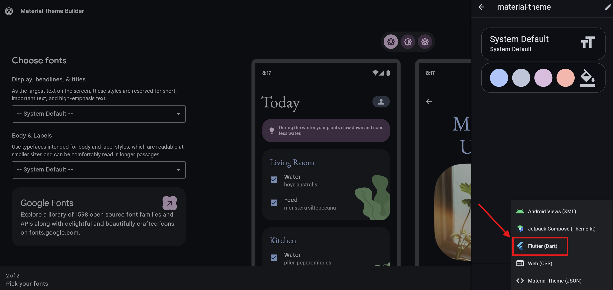

# Customize Your App

This guide explains how to configure the following settings in your app:

- Logo
- Theme
- Locale
- Landing page image
- List of Countries
- Validations

Jump directly to the section you’d like to customize.

## How do I change the logo?

Changing the logo is straightforward. The default logo is located at `assets/icon/logo.png`. To use your own logo:

1. Replace the existing image with your new logo and **keep the same file name**.
2. Make sure your logo is a `PNG` file, ideally sized at **512x512 pixels**.

After updating the logo, run the following command to apply it across all platforms:

```bash
dart run flutter_launcher_icons
```

## How do I change the theme?

This project uses Material UI, making theme customization simple and standard. We recommend using the Material Theme Builder plugin:  
 [https://material-foundation.github.io/material-theme-builder/](https://material-foundation.github.io/material-theme-builder/)

Follow these steps:

1. **Pick your primary color**  
   

2. **Important:** On the first screen, add the `Landing Button` (the name must match exactly). Adjust its color to match your `landing_bg` asset.  
     
   

3. **Pick your fonts**  
   

4. Click **"Export theme"**  
   

5. Download the `.dart` file using the export button at the bottom.  
   

6. Select **"Flutter Dart"** to download a ZIP file.  
   

7. Replace the existing `color_theme.dart` file in `lib/styles` with the one from the ZIP file.

## How do I add more locales?

All locale configurations are in the `lib/l10n` folder. To add a new language:

1. Create a `.arb` file for the new language. For example, to add Portuguese, create `app_pt.arb`.
2. Copy all translation keys from an existing locale file like `app_en.arb` and provide their Portuguese translations.

Once the new file is ready, run:

```bash
flutter gen-l10n
```

Next, add the new language to `lib/models/language_type.dart` so it appears in the app settings.

**Note:** By default, the app uses the system language and falls back to English if unavailable.

## How do I change the landing image?

You can change the landing page by replacing the `landing_bg.png` image inside `assets/image` folder. We recommend to use a large image for better quality.

⚠️ **Important:** You must use the same file name `landing_bg.png` and extension.

## How do I change the list of allowed countries?

The country list is defined in `lib/constants.dart`. You can add or remove countries by editing this list:

```dart
static final List<Map<String, String>> countryOptions = [
  {'value': 'CL', 'label': 'Chile'},
  {'value': 'PE', 'label': 'Peru'},
  {'value': 'CO', 'label': 'Colombia'},
  {'value': 'UY', 'label': 'Uruguay'},
  ...
  // Add more here!
];
```

⚠️ **Important:** Use standardized country codes. Follow this guide:  
[https://build.fhir.org/valueset-country.html](https://build.fhir.org/valueset-country.html)

## How do I change the validations?

Validation rules are also defined in `lib/constants.dart`. You can update or add new regex patterns as needed:

```dart
// National identifier regex (e.g., Chilean RUT)
static final RegExp dniRegex = RegExp(r'^[a-zA-Z0-9]{1,16}$');

// Common passport validation regex
static final RegExp passportRegex = RegExp(r'^[a-zA-Z0-9]{1,16}$');

// Optional: Strengthen the email regex if required
static final RegExp emailRegex =
    RegExp(r'^((?!\.)[\w\-_.]*[^.])(@\w+)(\.\w+(\.\w+)?[^.\W])$');
```
